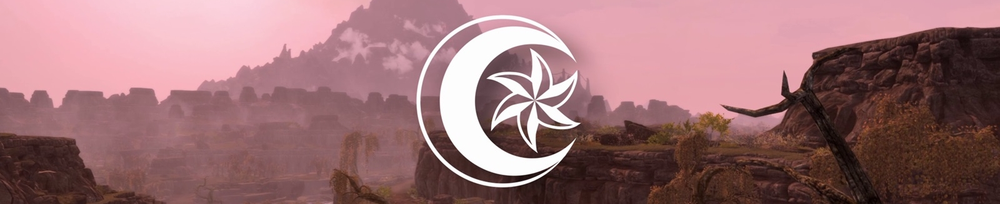
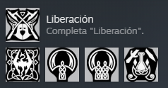
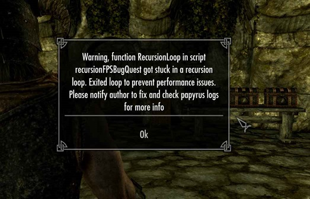
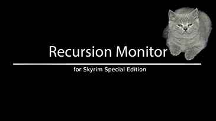

# Skywind modlist by Jaume Alcazo (WIP)

My modlist compilation for Skywind, thanks to all the authors! I plan on doing a [collection](https://next.nexusmods.com/) on [Nexusmods](https://www.nexusmods.com/skyrimspecialedition) with this modlist and maybe a [Wabbajack](https://www.wabbajack.org/) modlist. Contact me at jaume.alcazo@gmail.com



# Essential (many mods need these)

| Number | Mod | Brief explanation | Spanish translation |
|----------|----------|----------|----------|
| 1 | Skyrim Script Extender (SKSE64). (be sure to check if you install the version for [Steam](https://store.steampowered.com/sub/626153/) or for [GOG](https://www.gog.com/en/game/the_elder_scrolls_v_skyrim_anniversary_edition)!). | Essential. A lot of good mods use this as a base. | Para evitar que SKSE64 de Vortex Nexusmods **CAMBIE EL IDIOMA A ENGLISH** hay que primero [instalarlo de Vortex](https://www.nexusmods.com/skyrimspecialedition/mods/30379?tab=files) y luego bajarlo e instalarlo manualmente de [AQUÍ](https://skse.silverlock.org/) (comprobado 10/11/23). |
| 2 | [Address Library for SKSE Plugins.](https://www.nexusmods.com/skyrimspecialedition/mods/32444) | Be sure to pick Anniversary Edition AE or Special Edition SE (just one) when downloading. | Not needed. |
| 3 | [Spell Perk Item Distributor (SPID).](https://www.nexusmods.com/skyrimspecialedition/mods/36869) | SKSE plugin that is used add spells/perks/items/shouts, etc. to the NPCs. | Not needed. |
| 4 | [CBBE Body.](https://www.nexusmods.com/skyrimspecialedition/mods/198) | Nice body, UNP alternative gives nudes when looting females (not males), and it's kinda un-inmersive if you are doing a SFW playthrough. | [CBBE - Castellano - Spanish](https://www.nexusmods.com/skyrimspecialedition/mods/64240?tab=files) (updated 14 aug 2023). |
| 5 | [Achievements Mods Enabler.](https://www.nexusmods.com/skyrimspecialedition/mods/245) (Enables achievements in Skyrim SE/AE with mods. SKSE64 support). | Reenables Steam achievements back<br>  | Not needed. Furthermore: You don't need his DLL loader if you are using SKSE64 (which you should!). |
| 6 | [powerofthree's Papyrus Extender.](https://www.nexusmods.com/skyrimspecialedition/mods/22854) | SKSE64 plugin that extends Papyrus script functionality, with over 275 new Papyrus functions, and 29 events. | Not needed. |
| 7 | [Inventory Functions SE-AE.](https://www.nexusmods.com/skyrimspecialedition/mods/13366) | Allow mods filtering the inventory by keyword. | Not needed. |
| 8 | [Keyword Item Distributor (KID).](https://www.nexusmods.com/skyrimspecialedition/mods/55728) | Distributes keywords to different objects.  | Not needed. |
| 9 | [MergeMapper.](https://www.nexusmods.com/skyrimspecialedition/mods/74689) | Allows Papyrus scripts to be aware and also allows other DLLs to support zmerge merges.  | Not needed. |
| 10 | [Inventory Interface Information Injector.](https://www.nexusmods.com/skyrimspecialedition/mods/85702) | Inserts interesting information, including item icons, into the inventory interface. | [Inventory Interface Information Injector - Castellano - Spanish.](https://www.nexusmods.com/skyrimspecialedition/mods/94916) |
| 11 | [PapyrusUtil SE - Modders Scripting Utility Functions.](https://www.nexusmods.com/skyrimspecialedition/mods/13048) | Adds several new scripts with native functions that provide various conveniences related to data storage and other misc functions to the scripter/modder.  | Not needed. |
| 12 | [Racemenu.](https://www.nexusmods.com/skyrimspecialedition/mods/19080?tab=description) | todo | [RaceMenu - Castellano - Spanish](https://www.nexusmods.com/skyrimspecialedition/mods/64182) |
| 13 | [Headpart Whitelist.](https://www.nexusmods.com/skyrimspecialedition/mods/106126) | SKSE plugin that removes unnecessary NPC only/broken headparts from Racemenu. | Not needed. | 
| Total in this category: | 13 mods | | |

# Fixes/helpers

| Number | Mod | Brief explanation | Spanish translation |
|----------|----------|----------|----------|
| 1 | [Face Discoloration Fix.](https://www.nexusmods.com/skyrimspecialedition/mods/42441) | Eliminates the dreaded "dark face" issue that occurs when the game encounters FaceGen errors. | Not needed. |
| 2 | [Actor Limit Fix.](https://www.nexusmods.com/skyrimspecialedition/mods/32349) | Increases the number of actors that can move, make facial expressions, and have their lips synced to their voice lines at any given time. | Not needed. |
| 3 | [Scrambled Bugs.](https://www.nexusmods.com/skyrimspecialedition/mods/43532) | A collection of engine bug fixes and patches. | Not needed. |
| 4 | [MCM Helper](https://www.nexusmods.com/skyrimspecialedition/mods/53000) | Simplifies the creation of Mod Configuration Menus. | Not needed. |
| 5 | [Mfg Fix.](https://www.nexusmods.com/skyrimspecialedition/mods/11669) | Fixes the "mfg" console command and adds some more fixes. | Not needed. |
| 6 | [WIDeadBodyCleanupScript Crash Fix.](https://www.nexusmods.com/skyrimspecialedition/mods/62413) | Fixes a rare crash when saving due to wideadbodycleanupscript. | Not needed. |
| 7 | [CritterSpawn Congestion Fix.](https://www.nexusmods.com/skyrimspecialedition/mods/67276) | A fix for the bug spawner, clogging your script engine, causing stacks to be dumped and bugs to be spawned. | Not needed. |
| 8 | [NPC AI Process Position Fix - NG.](https://www.nexusmods.com/skyrimspecialedition/mods/69326) | Skyrim's engine has a limitation where it can only update an NPC’s AI process position for one hour at most if that NPC is loaded in currently loaded cells (a high AI Process one). | Not needed. |
| 9 | [Papyrus Tweaks NG](https://www.nexusmods.com/skyrimspecialedition/mods/77779) | Collection of fixes, tweaks, and performance improvements for Skyrim's script engine. 100% configurable. Install/Uninstall anytime. | Not needed. |
| 10 | [UIExtensions.](https://www.nexusmods.com/skyrimspecialedition/mods/17561) | Adds various custom menus to Skyrim for modder use. | [UIExtensions - Castellano - Spanish.](https://www.nexusmods.com/skyrimspecialedition/mods/89636) |
| 11 | [Tavern AI fix](https://www.nexusmods.com/skyrimspecialedition/mods/23107) | Fixes a couple of things in the behavior of tavern workers. | [Tavern AI Fix - Spanish Castellano Español](https://www.nexusmods.com/skyrimspecialedition/mods/94086) |
| 12 | [SSE Display Tweaks.](https://www.nexusmods.com/skyrimspecialedition/mods/34705) | todo | todo |
| 13 | [SSE FPS Stabilizer.](https://www.nexusmods.com/skyrimspecialedition/mods/38438) | todo | todo |
| 14 | [Recursion Monitor (Recursion Fix).](https://www.nexusmods.com/skyrimspecialedition/mods/76867) | Detects broken papyrus scripts stuck in recursion and prevents huge framerate lag  | Not needed. |
| Total in this category: | 14 mods | | |

 

# Armor, armors

| Number | Mod |  Brief explanation | Spanish translation |
|----------|----------|----------|----------|
| Total in this category: | 1 mods | | |

# Meshes

| Number | Mod |  Brief explanation | Spanish translation | Video review |
|----------|----------|----------|----------|----------|
| 1 | [Spriggans SE](https://www.nexusmods.com/skyrimspecialedition/mods/90547?tab=files&file_id=507165) | See image below. | Not needed. | :tv: todo |
| 2 | [Renthal's waterwheel HD.](https://www.nexusmods.com/skyrimspecialedition/mods/26567) | See screenshots below. | Not needed. | :tv: todo |
| 3 | [Kanjs - Bird Nests and Eggs - up to 4k.](https://www.nexusmods.com/skyrimspecialedition/mods/64905) | Retexture and remesh of all bird nests and eggs. | Not needed. | :tv: todo |
| Total in this category: | 3 mods | | |

# GUI / Interface / User Interface

| Number | Mod |  Brief explanation | Spanish translation |
|----------|----------|----------|----------|
| 1 | [SkyUI.](https://www.nexusmods.com/skyrimspecialedition/mods/12604) | Elegant, PC-friendly interface mod with many advanced features. | Not needed. Gives problems (Jaume 14/11/23). |
| 3 | [SkyUI-Style Quick Loot RE and EE Retexture.](https://www.nexusmods.com/skyrimspecialedition/mods/51017) | Retexture of Quick Loot to match SkyUI's colour scheme. | Not needed. |
| 4 | [TrueHUD - HUD Additions.](https://www.nexusmods.com/skyrimspecialedition/mods/62775) | Impressive HUD: <br>  | [TrueHUD - HUD Additions - Spanish - Castellano - Español.](https://www.nexusmods.com/skyrimspecialedition/mods/93935) |
| 5 | [Phenomenally Enriched and Nuanced Ingredients for SkyUI (P.E.N.I.S. for B.O.O.B.I.E.S.).](https://www.nexusmods.com/skyrimspecialedition/mods/90526) | Icons and colors for alchemical ingredients. | Not needed. |
| 6 | [Aura's Scrumptious Supplement (A.S.S. for B.O.O.B.I.E.S.).](https://www.nexusmods.com/skyrimspecialedition/mods/89823) | Icons and colors for food and other ingestible items. | Not needed. |
| 7 | [Better MessageBox Controls](https://www.nexusmods.com/skyrimspecialedition/mods/1428) | Navigate all message boxes with the Left/Right and Activate (E) keys. Also fixes the clickable area of buttons so they are easier to select with the mouse. | Not needed. |
| 8 | [Better Dialogue Controls](https://www.nexusmods.com/skyrimspecialedition/mods/1429) | todo | Not needed. |
| 9 | [Constructible Object Custom Keyword System.](https://www.nexusmods.com/skyrimspecialedition/mods/81409) | Improves the usability of the Constructible Object Menu with SkyUI with an extensible keyword-based category system. | [Crafting Categories for SkyUI - Constructible Object Custom Keyword System -Spanish - Español - Castellano.](https://www.nexusmods.com/skyrimspecialedition/mods/93728) |

Quickloot EE with quickloot EE patch for AE

Avoid:
  -	Morehud: Because Truehud is 1000 times better. (11/11/23 Jaume).
  
# Magic / Spells

| Number | Mod |  Brief explanation | Spanish translation | Video review |
|----------|----------|----------|----------|----------|
| 1 | [Inferno - Fire Effects Redux.](https://www.nexusmods.com/skyrimspecialedition/mods/29316) | Spiritual successor to the original Ultimate HD Fire Effects mod with improved meshes and textures! | Not needed. | :tv: todo |

# Combat

| Number | Mod |  Brief explanation | Spanish translation | Video review |
|----------|----------|----------|----------|----------|
| 1 | [Valhalla Combat.](https://www.nexusmods.com/skyrimspecialedition/mods/64741) | Script-free timed blocking, projectile parrying, stun and execution, and non-intrusive stamina management to push Skyrim's combat to modern standards. | [Valhalla Combat - Spanish (S)](https://www.nexusmods.com/skyrimspecialedition/mods/73675?tab=files&file_id=557682&nmm=1) | :tv: [Skyrim Mods Showcase - Valhalla Combat](https://www.youtube.com/watch?v=HYuSdUPaXEg) |
| 2 | [Precision - Accurate Melee Collisions.](https://www.nexusmods.com/skyrimspecialedition/mods/72347) | Physically accurate, true Havok collisions for melee. Procedural, physics-based hit reactions. Weapon trails. Hitstop and camera shake. Recoils when hitting certain materials. Supports both first person and third person, as well as other NPCs and creatures. | [Traduccion al Spanish de Precision - Accurate Melee Collisions](https://www.nexusmods.com/skyrimspecialedition/mods/101804) | :tv: todo |
| 3 | [Locational Damage(SKSE Plugin).](https://www.nexusmods.com/skyrimspecialedition/mods/46932) | This mod makes it possible to do extra damage and stagger etc. effect depending on the body part when the attack hits the actor. No ESP file. | Not needed. | :tv: todo |
| 4 | [Loading Screen Truce AE.](https://www.nexusmods.com/skyrimspecialedition/mods/104522) Disables NPC combat AI temporarily during the loading screen. | Not needed. | :tv: todo |
| 5 | [Dynamic Impact - Slash Effects X](https://www.nexusmods.com/skyrimspecialedition/mods/86071) | Not needed. | :tv: todo |
| 6 | [Immersive Weapon Switch - SKSE plugin](https://www.nexusmods.com/skyrimspecialedition/mods/139762) | Not needed. | :tv: todo |
| 7 | [Weapon switch animation Fix](https://www.nexusmods.com/skyrimspecialedition/mods/100366) | Not needed. | :tv: todo |
| 8 | [Weapon Switch Animation Fix - Behavior Patch Version](https://www.nexusmods.com/skyrimspecialedition/mods/125415) | Not needed. | :tv: todo |
| Total in this category: | 8 mods | | |

# Immersion

| Number | Mod | Brief explanation | Spanish translation | Video review |
|----------|----------|----------|----------|----------|
| 1 | [Destructible Skyrim - Containers](https://www.nexusmods.com/skyrimspecialedition/mods/143935) | Break containers open by smashing them to bits and watch as the pieces go flying and the loot comes spilling out. | Not needed | :tv: todo |
| 2 | [Destructible Skyrim - Breakable Objects SE (Beta)](https://www.nexusmods.com/skyrimspecialedition/mods/28291) | Smash objects to pieces and watch the physics enabled debris fly everywhere. Be careful in taverns or shops though as the guards won't take kindly to such reckless destruction. This is a small sample of what is to come for testing purposes. | [Destructible Skyrim - Breakable Objects SE - Spanish](https://www.nexusmods.com/skyrimspecialedition/mods/69703) | :tv: todo |
| 3 | [Flying Crows SSE.](https://www.nexusmods.com/skyrimspecialedition/mods/49270) | todo | todo | :tv: todo |
| 4 | [Nocturnal Moths.](https://www.nexusmods.com/skyrimspecialedition/mods/68288) | todo | todo | :tv: todo |
| 5 | [Footprints.](https://www.nexusmods.com/skyrimspecialedition/mods/3808) | todo | todo | :tv: todo |
| 6 | [Immersive Death Cycle (ESL flagged).](https://www.nexusmods.com/skyrimspecialedition/mods/97048) (See dead animals decay over time, eventually turning into bones. Super lite and without any vanilla edits, needs SPID essential mod, already installed before in this modlist). | [Immersive Death Cycle - Castellano - Spanish](https://www.nexusmods.com/skyrimspecialedition/mods/97175) | :tv: todo |
| 7 | [Fast Travel for Survival Mode.](https://www.nexusmods.com/skyrimspecialedition/mods/21067) | todo | todo | :tv: todo |
| 8 | [Scared of Shootings - NPCs react to aiming bows](https://www.nexusmods.com/skyrimspecialedition/mods/105622) | NPCs will react to aiming bows and crossbows by complaining, fleeing, attacking, and reporting you to the guards. <br> :tv: [Reviewed here by Master Cheesey.](https://www.youtube.com/watch?v=J0388aeYHng) | **Uses vanilla voices**. Not needed. |

# Cities

| Number | Mod | Brief explanation | Spanish translation | Video review |
|----------|----------|----------|----------|----------|
| Total in this category: | 0 mods | | |

# Alchemy / Potions / Ingredients / Food

| Mod | Brief explanation | Spanish translation |
|----------|----------|----------|

# Monsters / Creatures

| Mod | Brief explanation | Spanish translation |
|----------|----------|----------|

# Weather / fog / fogs / mists

| Mod | Brief explanation | Spanish translation |
|----------|----------|----------|
| [Cathedral Weathers and Seasons.](https://www.nexusmods.com/skyrimspecialedition/mods/24791) | [Cathedral Weathers and Seasons - Castellano - Spanish.](https://www.nexusmods.com/skyrimspecialedition/mods/86719) |
| [Morning Fogs SSE.](https://www.nexusmods.com/skyrimspecialedition/mods/21436) | Not needed. |
| [Volumetric Mists.](https://www.nexusmods.com/skyrimspecialedition/mods/29273) | Not needed. |

:tv: [Video review of Cathedral Weathers (comparison with other weathers)](https://www.youtube.com/watch?v=p_CMoTK-8bM)

# Animals, horses, hunting, fauna, wildlife, etc.

| Mod | Brief explanation | Spanish translation |
|----------|----------|----------|
| [Better Butterflies.](https://www.nexusmods.com/skyrimspecialedition/mods/79332) | Mesh and texture replacer for butterflies. | Not needed. |
| [Witcher Horse Expansion.](https://www.nexusmods.com/skyrimspecialedition/mods/72490) | ``` TO BE DONE 🚧 ``` |
| [Fluffworks (Fluffy Animals).](https://www.nexusmods.com/skyrimspecialedition/mods/56361) | Not needed. Better looking fur in animals. |
| [Fluffworks (Fluffy Animals) - Domestic Goat with Bell.](https://www.nexusmods.com/skyrimspecialedition/mods/64744) | Not needed. |

# NPC's

| Number | Mod | Brief explanation | Spanish translation | Video review |
|----------|----------|----------|----------|----------|
| 1 | [KS Hairdos SSE.](https://www.nexusmods.com/skyrimspecialedition/mods/6817) | Not needed. | :tv: todo |

# Expansions / DLC sized expansions

| Number | Mod | Brief explanation | Spanish translation | Video review |
|----------|----------|----------|----------|----------|

# Flora

| Mod | Brief explanation | Spanish translation |
|----------|----------|----------|

# Animations (OAR replaces DAR and it's fully compatible with DAR animations)

| Number | Mod | Brief explanation | Spanish translation |
|----------|----------|----------|----------|
| 1 | [Open Animation Replacer (OAR).](https://www.nexusmods.com/skyrimspecialedition/mods/92109) | Full backward compatibility with DAR. | Not needed. |
| 2 | [Animation Queue Fix.](https://www.nexusmods.com/skyrimspecialedition/mods/82395) (required by OAR). | todo | Not needed. |
| 3 | [Paired Animation Improvements.](https://www.nexusmods.com/skyrimspecialedition/mods/99621) | todo | Not needed. |
| 4 | [EVG Conditional Idles (DAR).](https://www.nexusmods.com/skyrimspecialedition/mods/34006) | :tv: [Video review of EVG Conditional Idles.](https://www.youtube.com/watch?v=XgtfmLYdNOk) |[EVG Conditional Idles - Spanish.](https://www.nexusmods.com/skyrimspecialedition/mods/66859) |
| 5 | [Male Player Animations (DAR).](https://www.nexusmods.com/skyrimspecialedition/mods/89225) | todo | Not needed. |
| 6 | [Female Player Animations (DAR).](https://www.nexusmods.com/skyrimspecialedition/mods/85073) | todo | Not needed. |
| 7 | [Gesture Animation Remix (DAR).](https://www.nexusmods.com/skyrimspecialedition/mods/64420) | Adds over 50 dialogue gesture animation variants according to NPC's personality, role in society, and by armor type. Works with custom followers and NPC from mods as well as vanilla. | Not needed. |
| 8 | [Conditional tavern cheering (DAR).](https://www.nexusmods.com/skyrimspecialedition/mods/63029) | todo | Not needed. |
| 9 | [Dynamic Swimming (DAR).](https://www.nexusmods.com/skyrimspecialedition/mods/34853?tab=description) | todo | Not needed. |
| 10 | [Lively Children Animations (DAR).](https://www.nexusmods.com/skyrimspecialedition/mods/67557) | todo | Not needed. |
| 11 | [Comprehensive First Person Animation Overhaul - CFPAO.](https://www.nexusmods.com/skyrimspecialedition/mods/87169) | todo | Not needed. |
| 12 | [Customizable Faster Woodcutting Animation - OAR or DAR.](https://www.nexusmods.com/skyrimspecialedition/mods/73857) | todo | Not needed. "Speeds up the wood chopping animation. 10%, 20%, 30%, 40%, 50%, 60%, 70%, 80%, 90% faster versions. Chopping sound is played in the correct frames.)" |
| 13 | [Dynamic Torch Idle Animations (OAR).](https://www.nexusmods.com/skyrimspecialedition/mods/103080) | todo | Not needed. | 
| 14 | [Riding Animation Overhaul - RAO (OAR - DAR).](https://www.nexusmods.com/skyrimspecialedition/mods/102881) | todo | Not needed. |

# Map

| Number | Mod | Brief explanation | Spanish translation | Video review |
|----------|----------|----------|----------|----------|
| Total in this category: | 3 mods | | |

# Paper map (optional)

| Number | Mod | Brief explanation | Spanish translation | Video review |
|----------|----------|----------|----------|----------|
| 1 | [Flat World Map Framework (FWMF).](https://www.nexusmods.com/skyrimspecialedition/mods/29932) (This mod changes default 3D Skyrim map to a flat one). | Not needed. Framework for all below. | :tv: todo |
| Total in this category: | 1 mods | | |
# Base Object Swapper (BOS)


| Mod | Brief explanation | Spanish translation |
|----------|----------|----------|
| [Base Object Swapper.](https://www.nexusmods.com/skyrimspecialedition/mods/60805) (needs [powerofthree's Tweaks](https://www.nexusmods.com/skyrimspecialedition/mods/51073)). | Used by a lot of mods to swap some items in the world. | Not needed. |
| 1 | [Better Blended Mushrooms.](https://www.nexusmods.com/skyrimspecialedition/mods/67725) | See screenshots below. | [Better Blended Mushrooms SPANISH by Jaume.](https://www.nexusmods.com/skyrimspecialedition/mods/104808) |
| 2 | [Destructible Skyrim - Base Object Swapper.](https://www.nexusmods.com/skyrimspecialedition/mods/77568) | "Smash, shout, and blow up the environment around you, without the need for silly, complicated patches! Be careful, though - just like with stealing, people aren't very fond of the destruction of their property!" | [Destructible Skyrim - Base Object Swapper SPANISH by Jaume.](https://www.nexusmods.com/skyrimspecialedition/mods/104800) |
| Total in this category: | 2 mods | | ||

# Audio / SFX / Sound / Soundtrack / Music

| Number | Mod | Brief explanation | Spanish translation | Video review |
|----------|----------|----------|----------|----------|
| 1 | [Sound Record Distributor.](https://www.nexusmods.com/skyrimspecialedition/mods/77815) | SKSE framework which allows sounds to be distributed at runtime, greatly simplifying audio mods and patches. | Not needed. | todo |
| 2 | [Tyler Cunningham Combat Music Pack.](https://www.nexusmods.com/skyrimspecialedition/mods/105581) | Combat Music pack replacer. | Not needed. | [Video review.](https://www.youtube.com/watch?v=LUNm-YENAe0) |
| 3 | [Ambient Warfare.](https://www.nexusmods.com/skyrimspecialedition/mods/113118) | Utilizes Sound Record Distributor to add ambient sounds of war to exterior regions. | Not needed. | :tv: [Ambient Warfare Subtle.](https://www.youtube.com/watch?v=S6iLoiYujrw) |
| 4 | [Murder of Songbirds.](https://www.nexusmods.com/skyrimspecialedition/mods/111766) | Utilizes Sound Record Distributor to play several varieties of bird (and bat) sounds throughout all regions of Skyrim. Including (but not limited to) hawks, crows, owls, seagulls, & woodpeckers. | Not needed. | :tv: [Murder of Songbirds 1](https://www.youtube.com/watch?v=cwUVfGG5dOM) |
| 5 | [Dungeon Sounds Overhaul](https://www.nexusmods.com/skyrimspecialedition/mods/66600) | Complete revamp of the original mod with highly modular fomod! | Not needed. | :tv: [Dungeon Sounds Overhaul 2.0 - Caves](https://www.youtube.com/watch?v=KwFbaf2QaGk) |
| 6 | [Immersive Music.](https://www.nexusmods.com/skyrimspecialedition/mods/16402) | Immersive Music adds 16 hours of carefully curated music that perfectly fits Skyrim. | Not needed. | :tv: [3 Hours of Ambient Fantasy - Immersive Music](https://www.youtube.com/watch?v=2PGcoOORV98) |
| Total in this category: | 6 mods | | | |

Good video reviewing a lot of audio mods: :tv: [The Best Audio Mods for Skyrim](https://www.youtube.com/watch?v=XXqmFLV-aGo)

# Character creation / presets / roleplaying / RPG

| Number | Mod | Brief explanation | Spanish translation | Video review |
|----------|----------|----------|----------|----------|
| 1 | [Reflection - Level Up Messages.](https://www.nexusmods.com/skyrimspecialedition/mods/1188) | todo | [Reflection - Level Up Messages Spanish Translation.](https://www.nexusmods.com/skyrimspecialedition/mods/58831) | :tv: todo |
| Total in this category: | 1 mods | | |

# Textures

| Mod | Brief explanation | Spanish translation |
|----------|----------|----------|
| [Better Chests.](https://www.nexusmods.com/skyrimspecialedition/mods/71680) | todo | Not needed. |
| [Enhanced Blood Textures.](https://www.nexusmods.com/skyrimspecialedition/mods/2357) | Esstential! | Not needed. |
| [Better Dwemer Spider Textures.](https://www.nexusmods.com/skyrimspecialedition/mods/3049) | todo | Not needed. |
| [WEBS S.E.](https://www.nexusmods.com/skyrimspecialedition/mods/4873) | This mod replaces and adds more unique and diverse textures, than the usual 3 used by the vanilla game, to spider webs, cobwebs and egg sacs placements throughout the entire game world.  | Not needed. |
| [RUSTIC WINDOWS - Special Edition.](https://www.nexusmods.com/skyrimspecialedition/mods/1937) | todo | Not needed. |
| [Dwemer Tech Glowmapped.](https://www.nexusmods.com/skyrimspecialedition/mods/47802) | todo | Not needed. |

# Forts

| Mod | Brief explanation | Spanish translation |
|----------|----------|----------|

# Dungeons

| Number | Mod | Brief explanation | Spanish translation | Video review |
|----------|----------|----------|----------|----------|

# Grim and Gore

| Mod | Brief explanation | Spanish translation |
|----------|----------|----------|

# Towers and Ruins

| Mod | Brief explanation | Spanish translation |
|----------|----------|----------|

# Shrines and statues

| Mod | Brief explanation | Spanish translation |
|----------|----------|----------|

# Collectibles

| Mod | Brief explanation | Spanish translation |
|----------|----------|----------|

# Quests

| Mod | Brief explanation | Spanish translation |
|----------|----------|----------|
